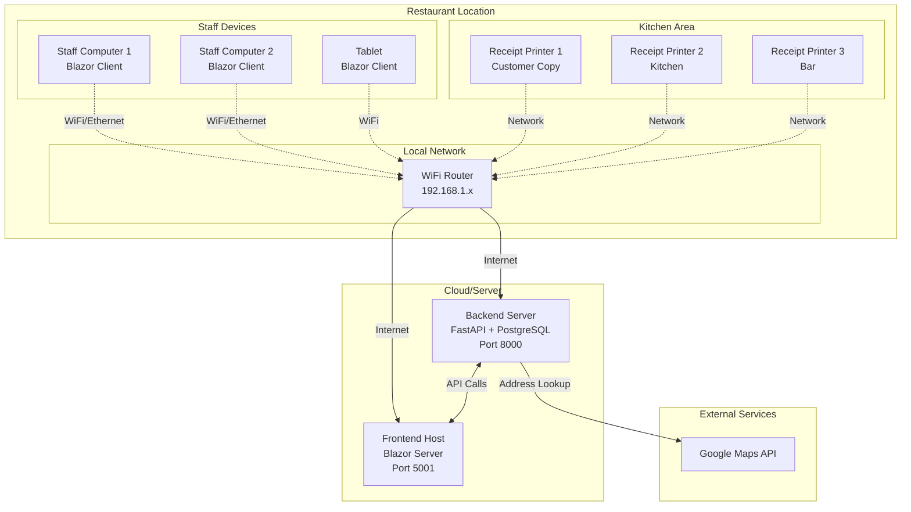
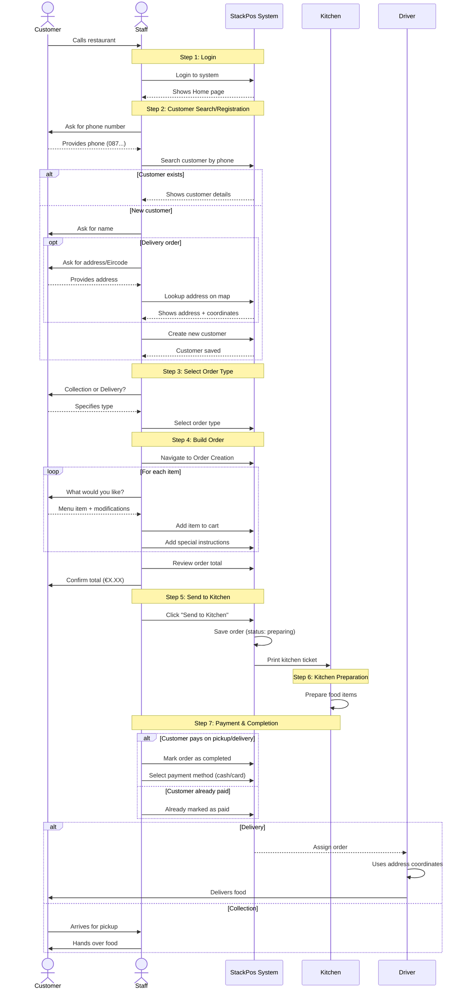
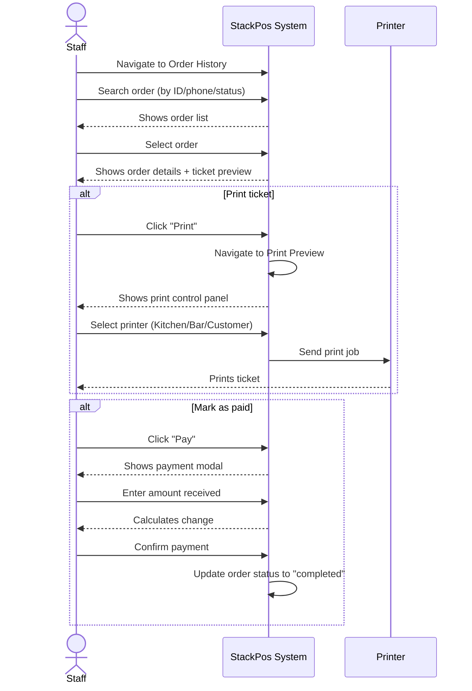
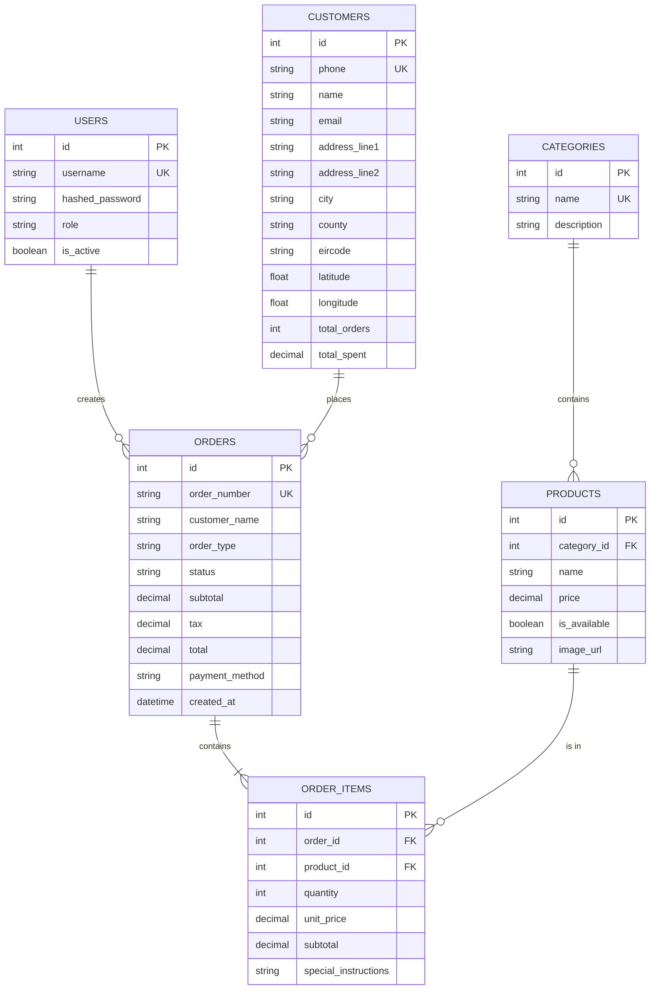
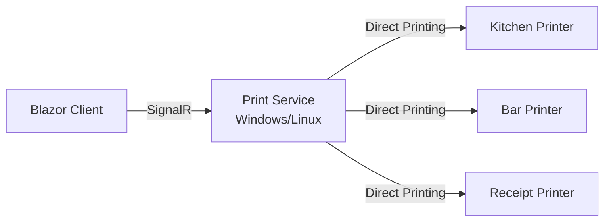

# StackPos - Restaurant POS System Documentation

## 1. Business Description

**StackPos** is a Point of Sale (POS) system designed for a restaurant that serves customers through multiple channels:

- **Dine-in**: Customers eat at the restaurant
- **Takeaway/Collection**: Customers call to order and pick up their food
- **Delivery**: Customers call to order and food is delivered to their address

The restaurant operates primarily through **phone orders** where staff (waiters/managers) take customer information and process orders.

---

## 2. Customer Order Flow

### 2.1 How Customers Place Orders

Currently, the system supports:

1. **Phone Orders** (Primary):
   - Customer calls restaurant phone number
   - Staff answers and takes the order
   - Staff uses POS system to process

2. **Future Planned**:
   - In-person orders (walk-in customers)
   - Online ordering (web/app)

### 2.2 Order Types

- **Collection/Takeaway**: Customer picks up
- **Delivery**: Restaurant delivers to customer address
- **Dine-in**: Customer eats at restaurant (future)

---

## 3. POS System Scope

### 3.1 What the POS System Handles

✅ **Currently Implemented:**
- Customer management (phone, name, address, location)
- Product catalog by categories
- Order creation (items, quantities, special instructions)
- Order management (status tracking: pending → preparing → completed)
- Payment processing (cash, card, voucher)
- Kitchen ticket printing
- Order history and search
- User authentication (admin/employee roles)

### 3.2 What is NOT in POS (External to System)

❌ **Outside System Scope:**
- Actual food preparation (kitchen physical work)
- Physical delivery logistics
- Inventory management (planned future)
- Supplier management (planned future)

---

## 4. System Architecture

### 4.1 Technology Stack

**Frontend (Client):**
- Blazor Server (.NET 8)
- C# / Razor Components
- CSS (Industrial/Retro theme)
- JavaScript (for maps, printing)

**Backend (Server):**
- FastAPI (Python)
- PostgreSQL Database
- JWT Authentication
- RESTful API

**External Services:**
- Google Maps API (address lookup, geocoding)

### 4.2 Physical Architecture Diagram



### 4.3 Current Deployment (Development)

```
Docker Containers:
├── burger-frontend (Blazor Server) - Port 5001
├── burger-backend (FastAPI) - Port 8000
└── burger-db (PostgreSQL) - Port 5432

Network: burger-network (Docker bridge)
```

---

## 5. Complete User Flow

### 5.1 Order Creation Flow (Phone Order)



### 5.2 Alternative Flow: Order History & Reprint



---

## 6. System Components & Pages

### 6.1 Frontend Pages

| Page | Route | Purpose | Status |
|------|-------|---------|--------|
| **Login** | `/login` | User authentication | ✅ Complete |
| **Home** | `/` | Select phone line & start order | ✅ Complete |
| **Order Creation** | `/order/{customerId}/{orderType}/{phoneLine}` | Build order, add items | ✅ Complete |
| **Order History** | `/ordenes` | View/search past orders | ✅ Complete |
| **Print Preview** | `/print-preview/{orderId}` | Review & print tickets | ✅ Complete |

### 6.2 Shared Components

| Component | Purpose | Location |
|-----------|---------|----------|
| `NavMenu` | Navigation sidebar | Layout |
| `CustomerModal` | Create/edit customer (with map lookup) | Shared |
| `CustomerSearchModal` | Search & select customer | Shared |

### 6.3 Backend Endpoints

**Authentication:**
- `POST /api/auth/login` - User login (JWT)
- `GET /api/auth/me` - Get current user

**Customers:**
- `GET /api/customers` - List customers (with search)
- `GET /api/customers/search-by-phone/{phone}` - Find by phone
- `POST /api/customers` - Create customer
- `PUT /api/customers/{id}` - Update customer

**Products & Categories:**
- `GET /api/products` - List products
- `GET /api/categories` - List categories

**Orders:**
- `GET /api/orders` - List orders (filter by status, order_type)
- `GET /api/orders/{id}` - Get order with items
- `POST /api/orders` - Create order with items
- `PATCH /api/orders/{id}/status` - Update order status

**Tables:**
- `GET /api/tables` - List tables (filter by status)
- `POST /api/tables` - Create table
- `PATCH /api/tables/{id}/status` - Update table status

**Modifiers:**
- `GET /api/modifiers` - List product modifiers
- `POST /api/modifiers` - Create modifier

**Reports:**
- `GET /api/reports/daily-sales` - Daily sales summary
- `GET /api/reports/top-products` - Best selling products
- `GET /api/reports/revenue-by-period` - Revenue breakdown (day/week/month)

---

## 7. Database Schema (Key Tables)



---

## 8. Key Features by Page

### 8.1 Home Page
- **Purpose**: Order flow selector
- **Features**:
  - 4 phone lines (visual tabs)
  - Active order display per line
  - Quick start buttons (Collection/Delivery)
  - Customer search modal
  - Backend health check

### 8.2 Order Creation
- **Purpose**: Build customer order
- **Features**:
  - Category tabs
  - Product grid (images, prices)
  - Shopping cart (right panel)
  - Item quantity controls
  - Special instructions per item
  - Real-time total calculation (subtotal, tax, total)
  - "Send to Kitchen" (status: preparing)
  - "Pay" button (status: completed)
  - Static ticket number generation

### 8.3 Order History
- **Purpose**: View & manage past orders
- **Features**:
  - Master-detail layout (list + ticket preview)
  - Filter by ID, phone, status
  - Electric blue row selection
  - Receipt-style ticket display (yellow paper theme)
  - Payment modal (numpad, methods, change calculator)
  - Print button → Print Preview

### 8.4 Print Preview
- **Purpose**: Control printing to multiple stations
- **Features**:
  - Split layout (controls + preview)
  - Station buttons (Kitchen, Bar)
  - "Print Full" vs "Print Last Edit"
  - Customer copy printing
  - Thermal receipt styling
  - Print media query (only ticket prints)

---

## 9. Security & Roles

### 9.1 Authentication
- JWT-based authentication
- Token stored in browser localStorage
- Token expiration: configurable

### 9.2 User Roles

| Role | Permissions |
|------|-------------|
| **admin** | Full access (view history, reports, manage users) |
| **employee** | Create orders, view own orders, basic operations |

### 9.3 Future Security Enhancements
- [ ] Password reset flow
- [ ] Session timeout
- [ ] Audit logging
- [ ] Role-based UI (hide sensitive features)

---

## 10. Printing Strategy

### 10.1 Current Implementation (Browser-based)

**Method**: JavaScript `window.print()` API

```javascript
function printReceipt(elementId) {
    var printContents = document.getElementById(elementId).innerHTML;
    var originalContents = document.body.innerHTML;
    document.body.innerHTML = printContents;
    window.print();
    document.body.innerHTML = originalContents;
    window.location.reload(); 
}
```

**Pros:**
- Works immediately in browser
- No additional software needed
- Cross-platform

**Cons:**
- Requires manual printer selection
- Page reload after print
- Not ideal for thermal printers

### 10.2 Recommended Production Solution

For a real restaurant environment, you should use:

**Option A: SignalR + Print Service (Recommended)**


**Option B: Cloud Print Service**
- Use services like PrintNode, StarCloudPRNT
- Send ticket data via API
- Cloud service handles printer communication

**Option C: Hybrid - Local Print Server**
- Deploy a small Windows/Linux server in restaurant
- Blazor sends print jobs to local server API
- Server handles direct printer communication

---

## 11. Web vs Desktop POS - Analysis

### 11.1 Your Concern: "Is Web-based POS feasible?"

**Short Answer**: YES, modern web-based POS systems are very common and secure.

### 11.2 Advantages of Web-based (Your Current Approach)

✅ **Accessibility**
- Access from any device (PC, tablet, phone)
- No installation needed
- Easy updates (just refresh browser)

✅ **Centralized Data**
- All data in cloud database
- Real-time sync across devices
- Easy backup/recovery

✅ **Multi-location Support**
- Same system for multiple restaurant branches
- Centralized reporting

✅ **Cost Effective**
- No per-device licensing
- Works on existing hardware
- Lower IT maintenance

### 11.3 Addressing Security Concerns

**Myth**: "Desktop is more secure than web"

**Reality**: Security depends on implementation, not platform.

**Your System's Security Measures:**
- ✅ HTTPS encryption (in production)
- ✅ JWT authentication
- ✅ Role-based access
- ✅ Password hashing
- 🔄 **Add**: IP whitelisting (restaurant network only)
- 🔄 **Add**: Session timeout
- 🔄 **Add**: Audit logging

### 11.4 Printing from Web App - Solutions

**Problem**: "Web apps can't communicate with printers directly"

**Solution 1**: Browser Print API (your current)
- Works for customer receipts
- Good for low-volume

**Solution 2**: Local Print Service
```
[Blazor Web App] --HTTP--> [Local Print Service (Port 8080)]
                            --> [Kitchen Printer]
                            --> [Bar Printer]
                            --> [Receipt Printer]
```

**Solution 3**: Cloud Printing (e.g., PrintNode)
```
[Blazor Web App] --API--> [PrintNode Cloud]
                          --> [Restaurant Printers]
```

### 11.5 Recommendation for Your Project

**Current Phase (Development)**: 
- ✅ Keep web-based Blazor
- ✅ Use browser print for demo
- ✅ Focus on core features

**Production Deployment**:
1. Deploy Blazor to Azure/AWS/DigitalOcean
2. Use HTTPS (SSL certificate)
3. Implement local print service (small Python/Node server)
4. Restrict access to restaurant IP range
5. Use VPN for remote access (if needed)

**Hybrid Approach** (Best of Both):
```
Web App (Cloud) for:
- Order management
- Customer database
- Reporting
- Updates

Local Services for:
- Printer communication
- Offline backup
- Kitchen display system
```

---

## 12. Current Project Status

### 12.1 Completed ✅

- [x] User authentication (login/logout)
- [x] Customer management (search, create, edit)
- [x] Product catalog display
- [x] Order creation workflow
- [x] Shopping cart functionality
- [x] Order status tracking
- [x] Order history & search
- [x] Payment modal (cash/card/voucher)
- [x] Print preview system
- [x] Google Maps integration (address lookup)
- [x] Responsive "Industrial" UI theme
- [x] Sales reports & analytics (daily, top products, revenue)
- [x] Table management (basic CRUD)
- [x] Product modifiers system

### 12.2 In Progress 🔄

- [ ] Kitchen display screen (shows "preparing" orders)
- [ ] Driver assignment & tracking
- [ ] Delivery fee calculation
- [ ] Order editing/cancellation

### 12.3 Planned 📋

- [ ] Inventory management
- [ ] Multi-location support
- [ ] Online ordering (customer-facing)
- [ ] Loyalty program

---

## 13. Next Steps for Documentation

### For Your Professor's Requirements:

1. **Business Description** → Section 1 ✅
2. **Order Flow** → Sections 2, 5 ✅
3. **POS System Scope** → Section 3 ✅
4. **Flow Charts** → Section 5 (Mermaid diagrams) ✅
5. **Physical Diagram** → Section 4.2 ✅

### Additional Documentation to Create:

- [ ] API Documentation (Swagger/OpenAPI)
- [ ] User Manual (for staff training)
- [ ] Deployment Guide
- [ ] Testing Plan
- [ ] Disaster Recovery Plan

---

## 14. Professional Advice

### 14.1 Answer to "Is Web POS Feasible?"

**YES** - Here's why major POS companies use web:

**Square**: Web + Mobile  
**Toast**: Web-based  
**Lightspeed**: Web-based  
**Shopify POS**: Web + Mobile

### 14.2 Your Specific Use Case

For a **single-location restaurant** taking **phone orders**:

✅ **Web-based is PERFECT** because:
- Limited number of devices (2-3 computers/tablets)
- All on same local network
- Easy to train staff (just open browser)
- Can access from owner's phone remotely
- Cheaper than proprietary POS hardware

### 14.3 Making it Production-Ready

**Minimum Changes Needed:**

1. **Deploy to Cloud**:
   - Frontend: Azure, AWS, or DigitalOcean
   - Database: Managed PostgreSQL
   - Cost: ~$20-50/month

2. **Add HTTPS**:
   - Get SSL certificate (Let's Encrypt - free)
   - Force HTTPS redirect

3. **Local Print Server** (optional):
   - Small Raspberry Pi or old PC
   - Runs Python service
   - Communicates with network printers

4. **Backup Strategy**:
   - Daily database backups
   - 30-day retention

**Total Cost**: ~$50/month + hardware you already have

---

## 15. Conclusion

Your **StackPos** system is well-designed for a web-based POS. The Blazor + FastAPI architecture is modern, scalable, and secure. The main challenge (printing) has proven solutions used by major POS companies.

**Recommendation**: Continue with web-based approach. For your school project, this demonstrates modern cloud architecture. For real deployment, add the print service component later.
